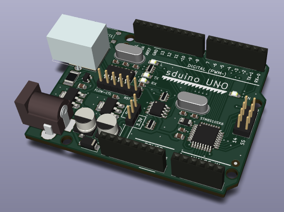

# sduino UNO

The __sduino UNO__ is an attempt at creating a mechanically and electrically Arduino-UNO-compatible development board based on the __STM8S105K6__ microcontroller.
Both, mechanical and electrical design are to a notable degree based on the [Arduino UNO board](https://store.arduino.cc/arduino-uno-rev3).

# Pin mapping

UNO pin name | ATMEGA328 pin name | STM8S105K6 pin name
-------------|--------------------|--------------------
AD0          | PC0                | PB0
AD1          | PC1                | PB1
AD2          | PC2                | PB2
AD3          | PC3                | PB3
AD4/SDA      | PC4                | PB5
AD5/SCL      | PC5                | PB4
IO0/RX       | PD0                | PD6
IO1/TX       | PD1                | PD5
IO2          | PD2                | PD7
IO3          | PD3                | PD2
IO4          | PD4                | PD0
IO5          | PD5                | PD4
IO6          | PD6                | PD3
IO7          | PD7                | PD1
IO8          | PB0                | PC1
IO9          | PB1                | PC3
IO10         | PB2                | PC4
IO11/MOSI    | PB3                | PC6
IO12/MISO    | PB4                | PC7
IO13/SCK     | PB5                | PC5
_IO14_       | -                  | PC2
_SS_         | -                  | PE5
AREF         | AREF               | PF4

# Differences

## Mechanical

The gap between the upper socket strips has been reduced from 0.06 to 0.05 inches.
This should not significantly impact mechanical compatibility with Arduino UNO shields and increases the available radius around the center of the upper left M3 mounting hole from 2.286 to 2.54 millimeters, which should be just enough to fit in a standard M3 spacer (5mm wrench).

## Electrical

Most importantly, the sduino UNO can be switched between 5V and 3.3V operating voltage.
The RX and TX LEDs are connected to the RX and TX lines (IO pin 0 and 1, respectively) via 1k resistors, rather than to the USB interface chip.

## Functional

Like many Arduino UNO clones, the sduino UNO uses CH340G USB to serial converter instead of an Atmega16U2 for communication with the host PC.
The USB interface Chip therefore cannot be repurposed as a coprocessor or keyboard/mouse simulator.
There is no analog comparator in the STM8S105K6 microcontroller.
IO11 has no PWM functionality, IO8 and IO4 have.
AREF is actually an additional analog input, its use as reference voltage for A/D conversion has to be imitated in software.
Likewise, IO10 does not dub as hardware-slave-select line for the SPI bus.  This, however, can mostly be overcome by software-emulation.
The actual slave-select line has been made available via an exra pin.

## Software

Unfortunately there is no C++ compiler available for the STM8 platform, yet.
The Arduino language along with the large pool of existing Arduino sketches can therefore not be used without modifications.

Fortunately there is the C-based [sduino library](https://github.com/tenbaht/sduino) that in fact inspired the creation of the sduino UNO and that this board borrows its name from.
By using the sduino library, the changes required to run many exsting Arduino sketches on an STM8 platform can be kept within manageable bounds.

Possibilities to bring C++ support to the STM8 platform are being evaluated.

# Copying

Even though the sduino UNO CAD files have been created from scratch and the design is not identical, to avoid legal ambiguity, the CAD files for the sduino UNO board are released under the same creative commons license as those of the Arduino UNO board:

This work is licensed under the Creative Commons Attribution-ShareAlike 2.5 Generic License. To view a copy of this license, visit http://creativecommons.org/licenses/by-sa/2.5/ or send a letter to Creative Commons, PO Box 1866, Mountain View, CA 94042, USA.
